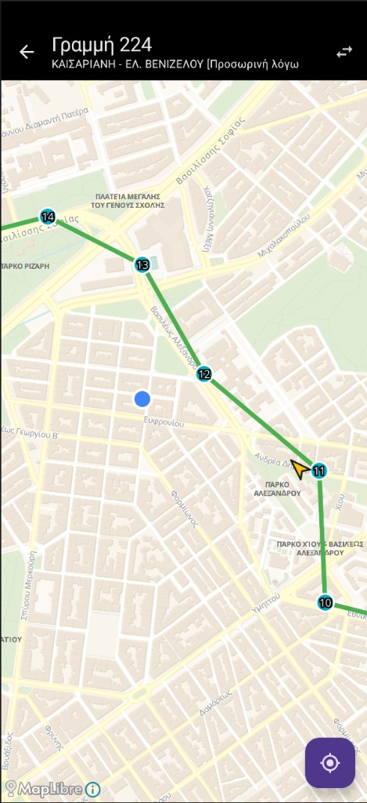

# Stasi

**Stasi** is a fast, privacy-minded Android app for **Athens public transport**. It talks to the official OASA Telematics API to show live arrivals, nearby stops, and route maps—without ads, sign-in, or extra clutter.

**Website:** [ntufar.github.io/stasi](https://ntufar.github.io/stasi/) (landing page for the project)

**Goal:** open the app and see your next bus in under a second.

| | |
| --- | --- |
| **Package** | `io.github.ntufar.stasi` |
| **Min / target SDK** | 26 / 34 |
| **Current version** | See `app/build.gradle.kts` (`versionName` / `versionCode`) and [CHANGELOG.md](CHANGELOG.md) |

---

## Features

- **Home** — Favorite stops with live next arrivals (two per stop).
- **Search** — Stops and lines by name with Greek-friendly normalization (accents ignored).
- **Arrivals** — Large countdown-style minutes, line id, destination.
- **Nearby** — GPS-based stops sorted by distance.
- **Map** — Route polyline, stops, live vehicle positions, and **your location** on the map when you allow location (MapLibre, no map API key).
- **Offline-friendly cache** — Lines/stops cached (24h policy in product spec), arrivals short-lived cache.

Design defaults: dark / AMOLED-friendly Material 3. Primary UI language Greek with English fallback where relevant.

**Not in scope (MVP):** ticket purchase, multi-leg journey planner, push notifications.

## Screenshot

Route map: line polyline, numbered stops, your location when permitted, and the recenter control (example: **Γραμμή 224**).



---

## Tech stack

- **Kotlin**, **Jetpack Compose**, **Material 3**
- **MVVM** + repository layer; **Retrofit** + **Gson**, **Coroutines**
- **Room** (cache), **DataStore** (preferences)
- **MapLibre** Android SDK
- **Google Play services — location** (coarse/fine for nearby stops)

Detailed API contracts, rate limits, and architecture notes live in [docs/SPEC.md](docs/SPEC.md).

---

## Prerequisites

- **JDK 17** (Temurin matches CI)
- **Android SDK** with API **34** platform / build-tools (Android Studio provides this)
- A device or emulator running **API 26+**

---

## Build locally

```bash
chmod +x ./gradlew   # once, if needed
./gradlew assembleDebug
```

Debug APK output:

`app/build/outputs/apk/debug/app-debug.apk`

CI builds the artifact with `-PstasiAbiArm64Only` ( **`arm64-v8a` only** ) so the downloadable APK stays small; omit that flag locally if you need x86 emulators or universal ABIs.

Run lint and unit tests:

```bash
./gradlew lintDebug testDebugUnitTest
```

Release builds require signing (see below). Release APKs/AABs use **R8 minification**, **resource shrinking**, and **phone ABIs only** (`arm64-v8a`, `armeabi-v7a`—no x86 emulator libs).

```bash
./gradlew assembleRelease bundleRelease
```

---

## Release signing

Release builds use **`keystore.properties`** at the repo root (gitignored). Copy the template and fill in your upload keystore:

```bash
cp keystore.properties.example keystore.properties
# Edit keystore.properties; place the keystore file where storeFile points (repo root is typical).
```

If `keystore.properties` is missing, Gradle still configures the **debug** build; **release** will not be signed with your upload key until the file exists.

---

## CI/CD (GitHub Actions)

### Android CI

On every push (any branch) and on **workflow_dispatch**:

- Lint, unit tests, and a **debug APK** artifact (**`stasi-debug-apk`**)—built in a dedicated job so you still get an APK when lint/tests fail but the project compiles. The artifact is **arm64-v8a-only** (smaller download; MapLibre ships large native libs per ABI).

Download: **Actions → latest “Android CI” run → Artifacts → `stasi-debug-apk`**.

### Release (Play bundle + GitHub Release)

Triggered by:

- **`workflow_dispatch`** — build signed **AAB** (+ APK); optional upload to Play when **Publish** is enabled.
- **Push of tags `v*`** — same build, plus a **GitHub Release** with **`stasi-<version>.apk`** and release notes sliced from [CHANGELOG.md](CHANGELOG.md) for that version.

**Repository secrets** (signed artifacts):

| Secret | Purpose |
| --- | --- |
| `RELEASE_KEYSTORE_BASE64` | Base64-encoded upload keystore file |
| `KEYSTORE_STORE_PASSWORD` | Keystore password |
| `KEYSTORE_KEY_ALIAS` | Key alias |
| `KEYSTORE_KEY_PASSWORD` | Key password |
| `PLAY_SERVICE_ACCOUNT_JSON` | *(Optional)* Play Developer API service account JSON for automated upload |

Play Console app must use package **`io.github.ntufar.stasi`** (or change `applicationId` before your first production upload).

---

## Changelog & versioning

- Human-readable history: [CHANGELOG.md](CHANGELOG.md) ([Keep a Changelog](https://keepachangelog.com/en/1.1.0/) style).
- Tag releases as **`vMAJOR.MINOR.PATCH`** (e.g. `v0.0.1`) to match the GitHub Release automation.

---

## Data & privacy

- Network data comes from **OASA Telematics** (`http://telematics.oasa.gr/api/`). The app uses **cleartext HTTP** for that endpoint (see manifest / network security configuration).
- **Location** is used for nearby stops and for **your position on the route map** when you allow it; the MVP spec does not persist location history.
- **No analytics / crash reporting** in the MVP spec—verify current code before claiming compliance in store listings.

---

## Project layout (high level)

```
app/src/main/java/io/github/ntufar/stasi/
  data/       # API, Room, repository, utilities
  di/         # App wiring / composition
  ui/         # Compose screens & theme
  MainActivity.kt, StasiApp.kt, StasiApplication.kt
docs/SPEC.md              # Product & technical specification
docs/screenshot-route-map.png  # README screenshot asset
```

---

## Contributing

Issues and pull requests are welcome. For releases, update **CHANGELOG.md** under **`[Unreleased]`**, then add a dated **`[x.y.z]`** section when you cut a tag.

---

## Disclaimer

Stasi is an independent client for public timetable/vehicle data. It is **not** affiliated with OASA or official transport operators. Schedules and live data depend on third-party services and may be incomplete or delayed.
