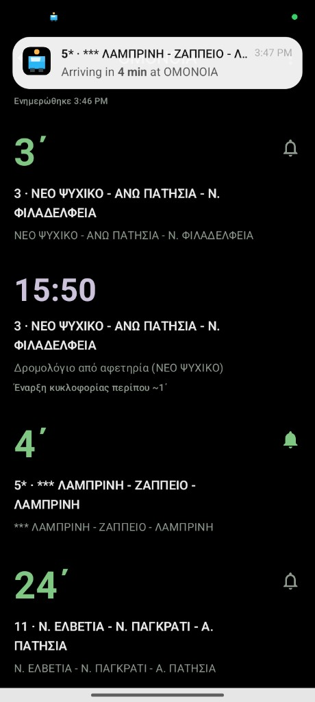
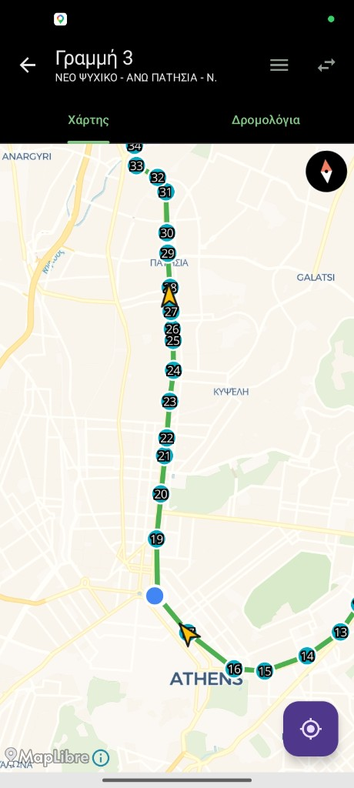

# Stasi

[](https://github.com/ntufar/stasi/actions/workflows/android-ci.yml)
[](LICENSE)
[](https://github.com/ntufar/stasi/releases)
[](https://kotlinlang.org/)
[](https://developer.android.com/about/versions)
[](https://developer.android.com/about/versions)
[](https://ntufar.github.io/stasi/)
[](https://play.google.com/store/apps/details?id=io.github.ntufar.stasi)

**Stasi** is a fast, privacy-minded Android app for **Athens public transport**. It talks to the official OASA Telematics API to show live arrivals, nearby stops, and route maps—without ads, sign-in, or extra clutter.

**Website:** [ntufar.github.io/stasi](https://ntufar.github.io/stasi/) (landing page for the project)

**Goal:** open the app and see your next bus in under a second.

## Screenshots

| Live arrivals at a stop | Route map with live vehicles |
| --- | --- |
|  |  |

| | |
| --- | --- |
| **Package** | `io.github.ntufar.stasi` |
| **Min / target SDK** | 26 / 35 |
| **Current version** | See `app/build.gradle.kts` (`versionName` / `versionCode`) and [CHANGELOG.md](CHANGELOG.md) |

---

## Features

- **Home** — Favorite stops with live next arrivals (two per stop).
- **Search** — Stops and lines by name with Greek-friendly normalization (accents ignored).
- **Arrivals** — Large countdown-style minutes, line id, destination.
- **Nearby** — GPS-based stops sorted by distance.
- **Map** — Route polyline, stops, live vehicle positions, and **your location** on the map when you allow location (MapLibre, no map API key).
- **Offline-friendly cache** — Lines/stops cached (24h policy in product spec), arrivals short-lived cache.
- **Arrival alerts** — Optional local notification when a chosen live arrival is within a few minutes (WorkManager + on-device storage; no remote push server).

Design defaults: dark / AMOLED-friendly Material 3. Primary UI language Greek with English fallback where relevant.

**Not in scope (MVP):** ticket purchase, multi-leg journey planner, **remote** push / marketing notifications (alerts are user-triggered and local-only).

---

## Tech stack

- **Kotlin**, **Jetpack Compose**, **Material 3**
- **MVVM** + repository layer; **Retrofit** + **Gson**, **Coroutines**
- **Room** (cache), **DataStore** (preferences + arrival alert state)
- **WorkManager** (arrival alert polling)
- **MapLibre** Android SDK
- **Google Play services — location** (coarse/fine for nearby stops)

Detailed API contracts, rate limits, and architecture notes live in [docs/SPEC.md](docs/SPEC.md).

---

## Prerequisites

- **JDK 17** (Temurin matches CI). If your shell’s default `java` is newer (e.g. JDK 26), Gradle can fail with a cryptic message—**pin 17** before running `./gradlew`:
  - **macOS:** `export JAVA_HOME=$(/usr/libexec/java_home -v 17)`
  - **Linux / Windows:** set `JAVA_HOME` to your JDK 17 install.
- **Android SDK** with API **35** platform / build-tools (Android Studio provides this)
- A device or emulator running **API 26+**

Cursor agents follow the same rule in **`.cursor/rules/jdk-17-gradle.mdc`**.

---

## Build locally

```bash
chmod +x ./gradlew   # once, if needed
./gradlew assembleDebug
```

Debug APK output:

`app/build/outputs/apk/debug/app-debug.apk`

CI builds the artifact with `-PstasiAbiArm64Only` ( **`arm64-v8a` only** ) so the downloadable APK stays small; omit that flag locally if you need x86 emulators or universal ABIs.

Run lint and unit tests:

```bash
./gradlew lintDebug testDebugUnitTest
```

Release builds require signing (see below). Release APKs/AABs use **R8 minification**, **resource shrinking**, and **phone ABIs only** (`arm64-v8a`, `armeabi-v7a`—no x86 emulator libs).

```bash
./gradlew assembleRelease bundleRelease
```

---

## Release signing

Release builds use **`keystore.properties`** at the repo root (gitignored). Copy the template and fill in your upload keystore:

```bash
cp keystore.properties.example keystore.properties
# Edit keystore.properties; place the keystore file where storeFile points (repo root is typical).
```

If `keystore.properties` is missing, Gradle still configures the **debug** build; **release** will not be signed with your upload key until the file exists.

---

## CI/CD (GitHub Actions)

### Android CI

On every push (any branch) and on **workflow_dispatch**:

- Lint, unit tests, and a **debug APK** artifact (**`stasi-debug-apk`**)—built in a dedicated job so you still get an APK when lint/tests fail but the project compiles. The artifact is **arm64-v8a-only** (smaller download; MapLibre ships large native libs per ABI).

Download: **Actions → latest “Android CI” run → Artifacts → `stasi-debug-apk`**.

### Release (Play bundle + GitHub Release)

Triggered by:

- **Push of tags `v*`** — build signed **AAB** (+ APK), create a **GitHub Release** (`stasi-<version>.apk` + [CHANGELOG.md](CHANGELOG.md) notes), and **upload the AAB to Google Play** automatically.
- **`workflow_dispatch`** — same build; optional manual Play upload (pick track).

**Play track routing** (tag push only; compares the new tag to the previous `v*.*.*` tag):

| Version change | Example | Play track |
| --- | --- | --- |
| Patch only | `v0.0.4` → `v0.0.5` | **beta** |
| Minor or major | `v0.0.4` → `v0.1.0`, `v0.1.0` → `v1.0.0` | **production** |
| First semver tag | `v0.0.1` | **beta** |

**Repository secrets**:

| Secret | Purpose |
| --- | --- |
| `RELEASE_KEYSTORE_BASE64` | Base64-encoded upload keystore file |
| `KEYSTORE_STORE_PASSWORD` | Keystore password |
| `KEYSTORE_KEY_ALIAS` | Key alias |
| `KEYSTORE_KEY_PASSWORD` | Key password |
| `PLAY_SERVICE_ACCOUNT_JSON` | Play Developer API service account JSON (**required** for tag releases) |

**One-time Play Console setup:** invite the service account under **Users and permissions** with permission to release to **beta** and **production**. Enable [Google Play Android Developer API](https://console.cloud.google.com/apis/library/androidpublisher.googleapis.com). Package name must be **`io.github.ntufar.stasi`**.

---

## Changelog & versioning

- Human-readable history: [CHANGELOG.md](CHANGELOG.md) ([Keep a Changelog](https://keepachangelog.com/en/1.1.0/) style).
- Tag releases as **`vMAJOR.MINOR.PATCH`** (e.g. `v0.0.4`). The tag must match **`versionName`** in `app/build.gradle.kts`; bump **`versionCode`** for every Play upload.

**Release checklist:**

1. Update [CHANGELOG.md](CHANGELOG.md) (`## [x.y.z] - date`).
2. Set `versionName` and increment `versionCode` in `app/build.gradle.kts`.
3. Commit, push, tag: `git tag v0.0.5 && git push origin v0.0.5`
4. **Actions → Release (Play bundle)** runs: GitHub Release + Play upload to **beta** (patch) or **production** (minor/major).

---

## Data & privacy

- **Privacy policy (web):** [ntufar.github.io/stasi/privacy.html](https://ntufar.github.io/stasi/privacy.html) — use this URL in Google Play Console.
- Network data comes from **OASA Telematics** (`http://telematics.oasa.gr/api/`). The app uses **cleartext HTTP** for that endpoint (see manifest).
- **Location** is used for nearby stops and for **your position on the route map** when you allow it; the MVP spec does not persist location history.
- **No analytics / crash reporting** in the MVP spec—verify current code before claiming compliance in store listings.

---

## Project layout (high level)

```
app/src/main/java/io/github/ntufar/stasi/
  data/       # API, Room, repository, utilities
  di/         # App wiring / composition
  workers/    # WorkManager jobs (e.g. arrival alerts)
  ui/         # Compose screens & theme
  MainActivity.kt, StasiApp.kt, StasiApplication.kt
docs/SPEC.md              # Product & technical specification
```

---

## License

This project is licensed under the [MIT License](LICENSE).

---

## Contributing

Issues and pull requests are welcome. For releases, update **CHANGELOG.md** under **`[Unreleased]`**, then add a dated **`[x.y.z]`** section when you cut a tag.

---

## Disclaimer

Stasi is an independent client for public timetable/vehicle data. It is **not** affiliated with OASA or official transport operators. Schedules and live data depend on third-party services and may be incomplete or delayed.
